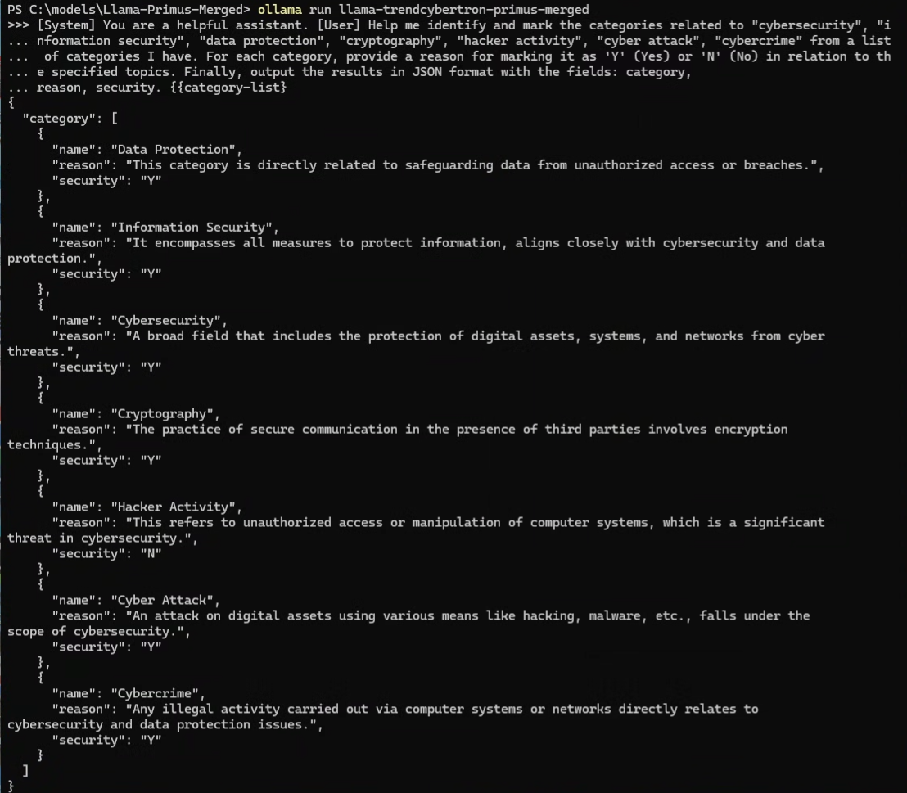

# How to run a specialized Trend Cybertron Cybersecurity LLM locally using Ollama

By David Girard, Trend Cybertron Product Manager

Head of AI Security & AI Alliances

Abstract : Large Language Models (LLMs) have shown remarkable
advancements in specialized fields such as finance, law, and medicine.
However, in cybersecurity, we have noticed a lack of open-source
datasets, with a particular lack of high-quality cybersecurity
pretraining corpora, even though much research indicates that LLMs
acquire their knowledge during pretraining. To address this, Trend Ailab
Team present a comprehensive suite of datasets covering all major
training stages, including pretraining, instruction fine-tuning, and
reasoning distillation with cybersecurity-specific self-reflection data.
Extensive ablation studies demonstrate their effectiveness on public
cybersecurity benchmarks. In particular, continual pre-training on our
dataset yields a 15.88% improvement in the aggregate score, while
reasoning distillation leads to a 10% gain in security certification
(CISSP). We will release all datasets and trained cybersecurity LLMs
under the ODC-BY and MIT licenses to encourage further research in the
community. This article aim towards Cybersecurity professionals which
could not be familiar with HuggingFace and therefore we will show you
how to install it on your local computer and run it in the popular
Ollama inference server which is available for Windows, Mac and Linux.

The scientific paper is located here :
<https://arxiv.org/abs/2502.11191>

For access to all datasets and model weights:
<https://huggingface.co/collections/trendmicro-ailab/primus-67b1fd27052b802b4af9d243>

Requirements:

- Ollama installed on a computer

- Git tool if you want to use this path or just use Web UI

- Access to HugginFace to download the model files

Before we start Primus is for research purposes and it is part of the
Trend Cybertron collection of models and agentic we are creating. Some
are embedded in our Trend Vision One platform and some will be released
as Open Weights and sources for the community. This year mark our 20th
anniversary in AI, we started with ML for spam detection in 2005, then
expanded in all domains. Happy birthday Trend AILab team!

Our team use safetensors and Ollama which use GGUF files can also import
from safetensors as described in their documentation here :
[ollama/docs/import.md at main · ollama/ollama ·
GitHub](https://github.com/ollama/ollama/blob/main/docs/import.md#Importing-a-model-from-Safetensors-weights)

Note, we might register our models directly with Ollama in the future to
skip those steps and have Trend Cybertron models directly in Ollama
directory.

1.  Install Ollama on your local Computer if not already done.

    a.  See instructions on Ollama.com <https://ollama.com/>

2.  Create a local models directory

> mkdir models
>
> cd models

3.  Get the Llama-Primus-Merged files (note, 16GB safetensors files can
    take some time to download)

> From either copying from HuggingFace UI or with git clone

a.  <https://huggingface.co/trendmicro-ailab/Llama-Primus-Merged/tree/main>

b.  Git clone
    <https://huggingface.co/trendmicro-ailab/Llama-Primus-Merged>

> {width="5.423889982502187in"
> height="1.3820155293088363in"}

4.  In the Llama-Primus-Merged folder you should have :

{width="5.215545713035871in"
height="2.2362259405074365in"}

5.  Creating the model from Ollama create command (in my case I will
    name it Llama-trendcybertron-primus-merged). You must be in the
    Llama-Primus-Merged folder when you run ollama create
    llama-trendcybertron-primus-merged otherwise Ollama won't find the
    safetensors files (models weights)

> {width="5.875301837270341in"
> height="2.2987292213473314in"}

6.  Now check if it is your model list with Ollama list command

{width="5.687791994750656in"
height="0.5833628608923884in"}

7.  run it with Ollama run TrendCybertron-Primus-Merged

Let's test it with a prompt

> {width="6.5in" height="5.6875in"}

You can now enjoy a local Trend Cybertron Cybersecurity Model Fined
tuned by Trend Micro AILab team

Now if you want to test it with either Ollama or LM Studio, use the StreamLit App which is the sub directory LocalCyberLLMTesterApp
